# Spring Microservices Refresher (SMR)

- Naming server - http://localhost:8761/
- Microservice 1 - http://localhost:8000/
- Microservice 2 - http://localhost:8001/
- H2 Database - http://localhost:8080/h2-console
- Gateway - http://localhost:8765
  - http://localhost:8765/currency-exchange/from/USD/to/INR
  - http://localhost:8765/currency-conversion/from/USD/to/INR/quantity/10
  - http://localhost:8765/currency-conversion-feign/from/USD/to/INR/quantity/10
  - http://localhost:8765/currency-conversion-new/from/USD/to/INR/quantity/10


## Introduction
- Spring boot
- Spring Cloud
- Spring Cloud Gateway
- Resilience4j
- Docker
- Kubernetes

## Microservices Overview

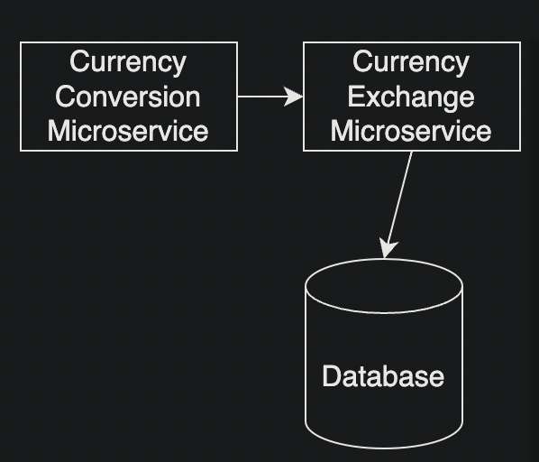

## Naming Server

In a microservice architecture, a naming server serves as a registry for service discovery. Each microservice in the system has a unique name and runs on its own address, and the naming server maintains a mapping between the service names and their addresses. When a client wants to access a certain microservice, it can query the naming server to find the address of the service it needs. This eliminates the need for hard-coded addresses and allows for dynamic reconfiguration of the system as services come and go. The naming server plays a crucial role in the seamless functioning of a microservice-based system.


In this example we use Eureka naming server.

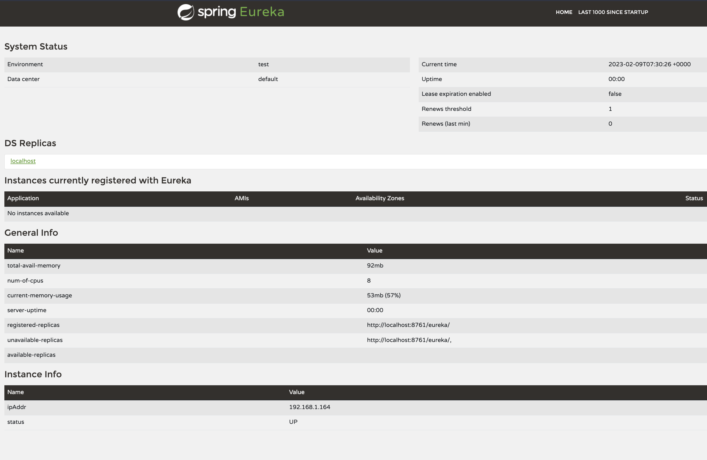

## Load Balancing

In a microservice architecture, a load balancer is an important component that sits between the client and the microservices. Its primary function is to distribute incoming requests to multiple instances of a microservice, improving system reliability and scalability.

When a client makes a request, the load balancer routes it to one of the available instances of the target microservice. This helps to evenly distribute the incoming request load, avoid overloading any single instance, and prevent a single point of failure. In case an instance of the microservice fails, the load balancer can detect this and redirect requests to other healthy instances.

By using a load balancer, microservice-based systems can dynamically scale up or down the number of instances of a service based on the incoming request volume, ensuring that the system remains responsive and resilient even under high load.

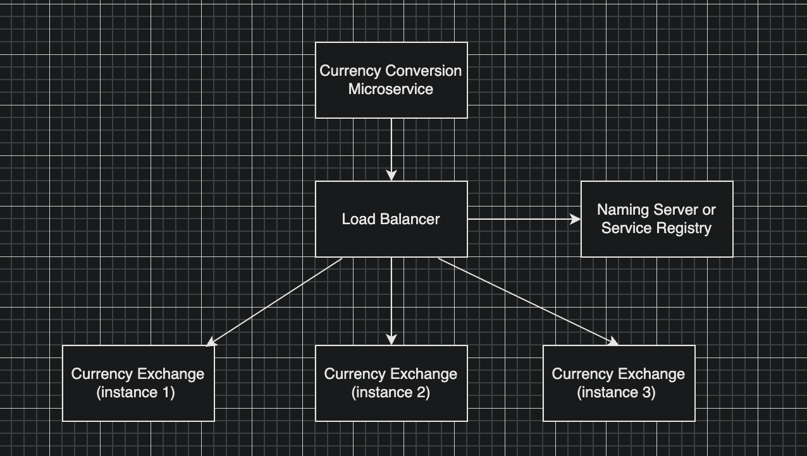

## API Gateway (Spring Cloud Gateway)

An API gateway is a single entry point for all requests from clients to the backend services in a microservice architecture. It sits between the client and the microservices and routes requests to the appropriate microservice. It also provides a single place to apply common cross-cutting concerns such as security, monitoring, and resiliency.

## Obeservability and OpenTelemetry

- Obeservability is the ability to understand the internal state of a system by means of its external outputs.
  - Step 1 - gather data (metrics, logs, traces)
  - Step 2 - analyse data (dashboards, alerts, reports, AI/Ops, anomaly detection)
- OpenTelemetry is a collection of tools, APIs, and SDKs. You can use it to instrument, generate, collect, and export telemetry data (metrics, logs, and traces) for analysis in order to understand your software's performance and behavior.

## Distributed Tracing (Zipkin)

Distributed tracing is a technique that helps to monitor and troubleshoot complex distributed systems. It allows developers to trace the flow of a request as it is processed by multiple microservices. This helps to identify performance bottlenecks and errors in the system.

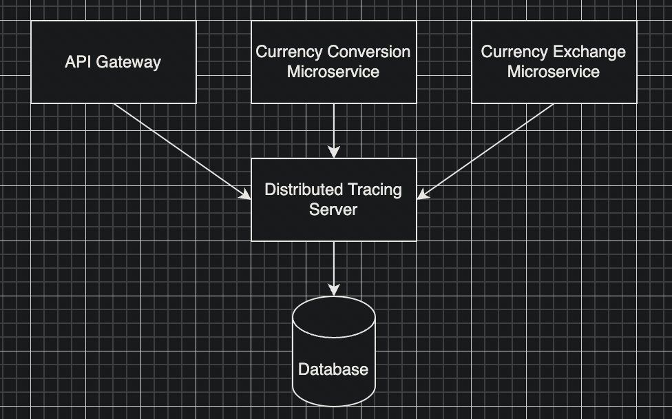

In this example we use Zipkin distributed tracing.

1. `docker run -d -p 9411:9411 openzipkin/zipkin`
2. http://localhost:9411/zipkin/

## Spring Boot Actuator

- Spring Boot Actuator provides production-ready features to help you monitor and manage your application. You can choose to manage and monitor your application by using HTTP endpoints or with JMX. For example, you can choose to expose health, metrics, and trace information over HTTP or to JMX.

- Spring Boot Actuator provides a number of additional features to help you monitor and manage your application when it’s pushed to production. You can choose to manage and monitor your application by using HTTP endpoints or with JMX. For example, you can choose to expose health, metrics, and trace information over HTTP or to JMX.

### Micrometer (Spring Boot Actuator)

- Micrometer is a metrics instrumentation library for JVM-based applications. It provides a simple facade over the instrumentation clients for the most popular monitoring systems, allowing you to instrument your code without vendor lock-in. Think SLF4J, but for metrics.


### OpenTelemetry (Spring Boot Actuator)

- OpenTelemetry is a collection of tools, APIs, and SDKs. You can use it to instrument, generate, collect, and export telemetry data (metrics, logs, and traces) for analysis in order to understand your software's performance and behavior.

## Docker

- Docker is a tool designed to make it easier to create, deploy, and run applications by using containers.

- A container is a standard unit of software that packages up code and all its dependencies so the application runs quickly and reliably from one computing environment to another.

- A Docker container image is a lightweight, standalone, executable package of software that includes everything needed to run an application: code, runtime, system tools, system libraries and settings.

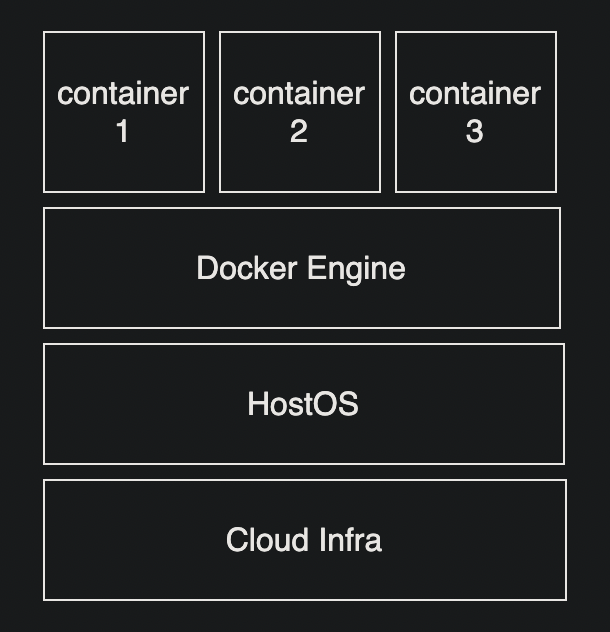

## Docker Architecture

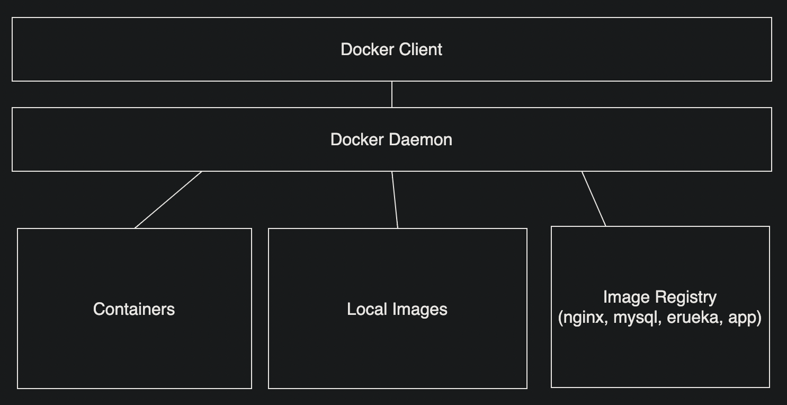

### Docker example commands

- `docker events` - show events
- `docker info` - show info
- `docker stats` - show stats metrics
- `docker system df` - show disk usage of docker
- `docker inspect <container id>` - show details of container
- `docker top <container id>` - show processes running inside container
- `docker ps` - list running containers
- `docker ps -a` - list all containers
- `docker images` - list images
- `docker run <image-name>` - run image
- `docker run <image-name> -m 512m --cpu-quota 50000` - run image with memory and cpu limits (512mb and 50% of cpu)
- `docker run -p 8080:8080 -d <image-name>` - detach flag (run container in background - no terminal)
- `docker run -p 8080:8080 --restart=always <image-name>` - docker container will auto run on docker engine start
- `docker run -p 8080:8080 <image-name>` - run image and map port 8080 to 8080
- `docker logs <container id>` - show logs
- `docker logs <container id> -f` - show logs and follows
- `docker image history <image-name>` - show history of image
- `docker image inspect <image-name>` - show details of image
- `docker run -p 8080:8080 -e "SPRING_PROFILES_ACTIVE=dev" <image-name>` - run image and map port 8080 to 8080 and set environment variable
- `docker run -p 8080:8080 -e "SPRING_PROFILES_ACTIVE=dev" -e "SPRING_DATASOURCE_URL=jdbc:mysql://localhost:3306/currency_exchange" <image-name>` - run image and map port 8080 to 8080 and set environment variable
- `docker run -p 8080:8080 -e "SPRING_PROFILES_ACTIVE=dev" -e "SPRING_DATASOURCE_URL=jdbc:mysql://localhost:3306/currency_exchange" -e "SPRING_DATASOURCE_USERNAME=root" -e "SPRING_DATASOURCE_PASSWORD=root" <image-name>` - run image and map port 8080 to 8080 and set environment variable
- `docker run -p 8080:8080 -e "SPRING_PROFILES_ACTIVE=dev" -e "SPRING_DATASOURCE_URL=jdbc:mysql://localhost:3306/currency_exchange" -e "SPRING_DATASOURCE_USERNAME=root" -e "SPRING_DATASOURCE_PASSWORD=root" -e "SPRING_DATASOURCE_DRIVER-CLASS-NAME=com.mysql.cj.jdbc.Driver" <image-name>` - run image and map port 8080 to 8080 and set environment variable
- `docker run -p 8080:8080 -e "SPRING_PROFILES_ACTIVE=dev" -e "SPRING_DATASOURCE_URL=jdbc:mysql://localhost:3306/currency_exchange" -e "SPRING_DATASOURCE_USERNAME=root" -e "SPRING_DATASOURCE_PASSWORD=root" -e "SPRING_DATASOURCE_DRIVER-CLASS-NAME=com.mysql.cj.jdbc.Driver" -e "SPRING_JPA_HIBERNATE_DDL-AUTO=update" <image-name>` - run image and map port 8080 to 8080 and set environment variable
- `docker run -p 8080:8080 -e "SPRING_PROFILES_ACTIVE=dev" -e "SPRING_DATASOURCE_URL=jdbc:mysql://localhost:3306/currency_exchange" -e "SPRING_DATASOURCE_USERNAME=root" -e "SPRING_DATASOURCE_PASSWORD=root" -e "SPRING_DATASOURCE_DRIVER-CLASS-NAME=com.mysql.cj.jdbc.Driver" -e "SPRING_JPA_HIBERNATE_DDL-AUTO=update" -e "SPRING_JPA_SHOW-SQL=true" <image-name>` - run image and map port 8080 to 8080 and set environment variable

### Creating a container image with Maven

- Add the following to the `pom.xml` file
```
<build>
		<plugins>
			<plugin>
				<groupId>org.springframework.boot</groupId>
				<artifactId>spring-boot-maven-plugin</artifactId>
				<configuration>
					<image>
						<name>seanmayerz/smr-${project.artifactId}:${project.version}</name>
					</image>
					<pullPolicy>IF_NOT_PRESENT</pullPolicy>
				</configuration>
			</plugin>
		</plugins>
	</build>
```
### Creating images with Maven
1. For each microservice repo: `mvn spring-boot:build-image -DskipTests`

### Running images with Docker manually
- `docker network create smr-network`
- `docker run --name eureka-server --network smr-network -p 8761:8761 seanmayerz/smr-naming-server:0.0.1-SNAPSHOT`
- `docker run -e JAVA_OPTS="-Dserver.port=8000" --name currency-exchange-service --network smr-network -p 8000:8000 seanmayerz/smr-currency-exchange-service:0.0.1-SNAPSHOT`

### Running images with Docker Compose
- Navigate to docker-compose.yaml and execute `docker-compose up`
- `docker-compose down` - remove all containers, networks, and volumes 

### Spring Cloud Gateway

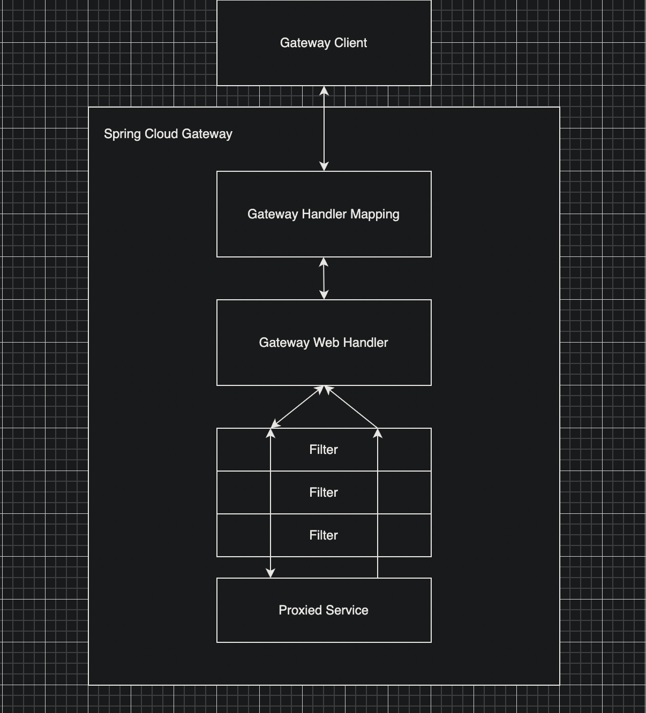

- Simple effective way to route APIs
- Provide cross-cutting concerns like:
  - security
  - monitoring/metrics
  - resiliency
- Built on top of Spring WebFlux framework(non-blocking, reactive)
- Features:
  - Matching routes on any request attribute
  - Dynamic routing
  - Predicates
  - Filters
  - Integrates with Spring Cloud DiscoveryClient (Load Balancing - Eureka, Consul, Zookeeper, etc)
  - Path Rewriting

## Circuit Breaker (Resilience4j)

- The library is inspired by Hystrix 
- but offers a much more convenient API and a number of other features:
    - Rate Limiter (block too frequent requests)
    - Bulkhead (avoid too many concurrent requests)
    - Retry (automatically retry failed requests)
    - Cache (avoid duplicate requests)
    - Circuit Breaker (avoid cascading failures)
    - Time Limiter (avoid too long running requests)
    - Event Listeners (monitoring)

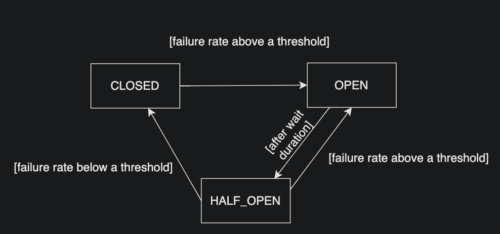

## Testing endpoint with multiple requests using Apache Bench

- Open terminal
- Run `ab -n 1000 -c 100 http://localhost:8000/sample-api`

## Container Orchestration

- Container orchestration is the process of managing containers at scale
- Container orchestration tools help to automate the deployment, scaling, and management of containerized applications
- Container orchestration tools are used to manage the lifecycle of containers

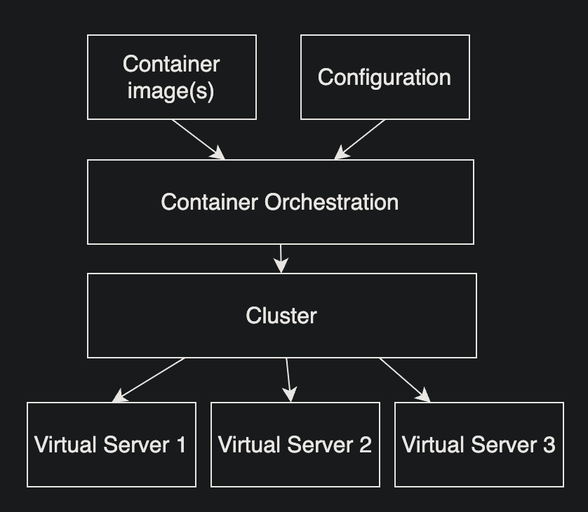

### Kubernetes

- Kubernetes is an open-source system for automating deployment, scaling, and management of containerized applications
- Kubernetes is a portable, extensible, open-source platform for managing containerized workloads and services, that facilitates both declarative configuration and automation
- Kubernetes is a production-ready platform that can be used to deploy and manage containerized applications in a cloud environment
- Kubernetes is a container orchestration tool that is used to automate the deployment, scaling, and management of containerized applications

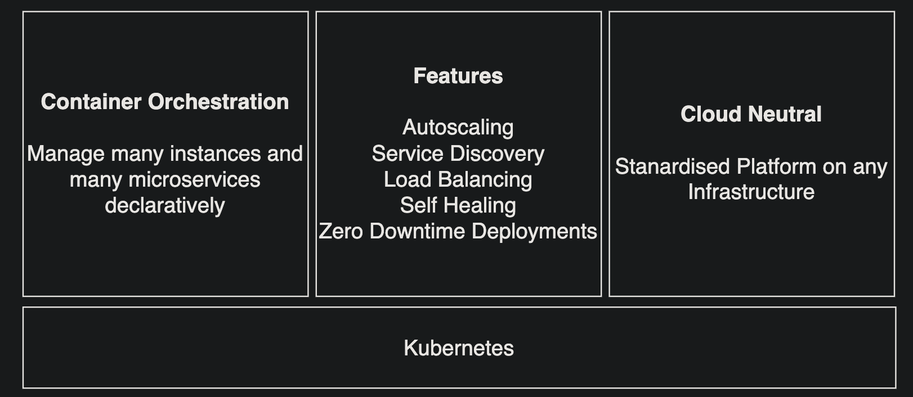

#### Kubernetes Architecture

- Kubernetes is a cluster of nodes
- A node is a worker machine in Kubernetes
- A node may be a VM or physical machine, depending on the cluster
- Each node has the services necessary to run Pods and is managed by the master components
- The control plane's components make global decisions about the cluster (e.g., scheduling), as well as detecting and responding to cluster events (e.g., starting up a new pod when a deployment's `replicas` field is unsatisfied)
- The control plane's components include the Kubernetes API server, scheduler, and core resource controllers
- The node components run on every node, maintaining running pods and providing the Kubernetes runtime environment

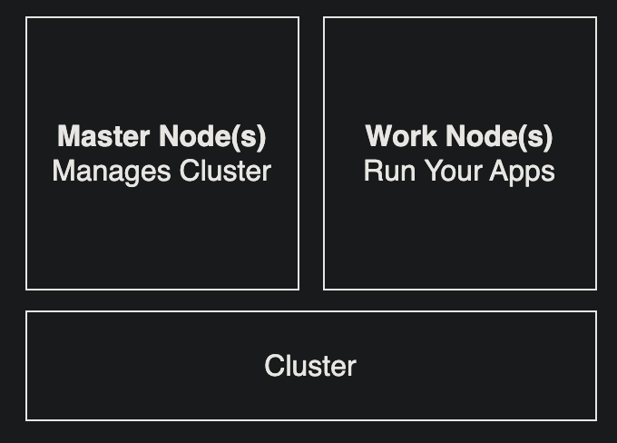

Kuberenetes uses single responsibility (pods, services, deployments, etc) to manage containers

- manage workloads
- provide external access to workloads
- enable scaling
- enable zero downtime deployments

##### Kubernetes Master Node

- The master node is responsible for managing the cluster
- The master node runs the Kubernetes control plane
- The Kubernetes control plane consists of the Kubernetes API server, scheduler, and core resource controllers

Api Server

- The API server is the front end for the Kubernetes control plane
- The API server is the only Kubernetes component that talks to the Kubernetes API  
- The API server is responsible for:
  - serving the Kubernetes API
  - scheduling workloads
  - controlling access to the cluster
  - maintaining the current state of the cluster
  - scaling the cluster

Distributed Database (etcd)

- The distributed database is a highly available key-value store used as Kubernetes' backing store for all cluster data
- The distributed database is used to store the state of the cluster

Scheduler

- The scheduler is responsible for distributing workloads across the cluster
- The scheduler watches newly created pods that have no node assigned
- For every pod that the scheduler discovers, the scheduler becomes responsible for finding the best node for that pod to run on
- The scheduler makes scheduling decisions based on the configured policies

Controller Manager

- The controller manager is a daemon that embeds the core control loops
- A control loop is a non-terminating loop that regulates the state of the cluster
- The controller manager runs all the control loops in separate goroutines
- The controller manager is responsible for:
  - maintaining the desired state of the cluster
  - responding to cluster events (e.g., starting up a new pod when a deployment's `replicas` field is unsatisfied)
  - managing the shared state of the cluster

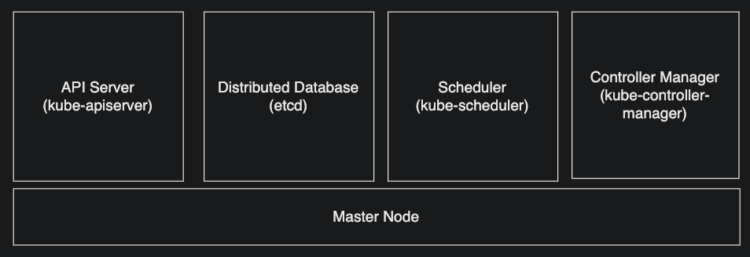

##### Kubernetes Worker Node

- The worker node is responsible for running the workloads
- The worker node runs the Kubernetes node components
- The Kubernetes node components include kubelet, kube-proxy, and container runtime

Kubelet

- The kubelet is the primary "node agent" that runs on each node
- The kubelet is responsible for:
  - ensuring that containers are running in a pod
  - reporting the node's health
  - handling node-level events (e.g., starting up a pod when a deployment's `replicas` field is unsatisfied)

Kube Proxy

- The kube proxy is responsible for maintaining network rules on the node
- The kube proxy maintains network rules on the node
- These network rules allow network communication to your Pods from network sessions inside or outside of your cluster
- The kube proxy uses the operating system packet filtering layer if there is one and it's available
- The kube proxy maintains network rules on the node
- These network rules allow network communication to your Pods from network sessions inside or outside of your cluster
- The kube proxy uses the operating system packet filtering layer if there is one and it's available

Container Runtime

- The container runtime is the software that is responsible for running containers

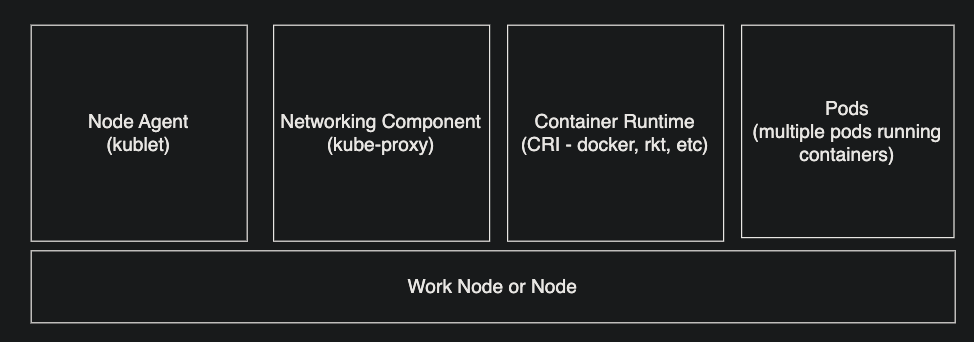

#### Kubernetes Pods!

- A pod is the smallest deployable unit of computing that can be created and managed in Kubernetes
- A pod (as in a pod of whales or pea pod) is a group of one or more containers (such as Docker containers), with shared storage/network, and a specification for how to run the containers
- A pod's contents are always co-located and co-scheduled, and run in a shared context
- A pod models an application-specific "logical host" - it contains one or more application containers which are relatively tightly coupled
- A pod can contain different application containers which are relatively tightly coupled

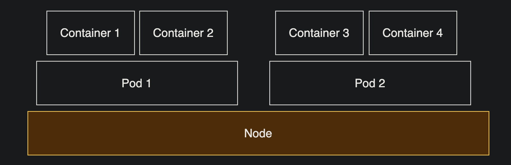

How to get a pod's IP address?

- `kubectl get pods -o wide` - get all pods with IP address (each pod has a unique IP address)

How to get a pod's logs?

- `kubectl logs <pod-name>` - get logs for a pod

How to get a pod's shell?

- `kubectl exec -it <pod-name> -- /bin/bash` - get a shell for a pod

How to describe a pod?

- `kubectl describe pod <pod-name>` - get detailed information about a pod

#### Kubernetes ReplicaSets

- A ReplicaSet's purpose is to maintain a stable set of replica Pods running at any given time
- A ReplicaSet is defined with fields, including a selector which specifies how to identify Pods it can acquire, a number of replicas indicating how many Pods it should be maintaining, and a pod template specifying the data of new Pods it should create to meet the number of replicas criteria
- A ReplicaSet is responsible for creating and deleting Pods as needed to reach the desired number of replicas
- A ReplicaSet is often used to guarantee the availability of a specified number of identical Pods

How to get a ReplicaSets

- `kubectl get replicasets` - get all ReplicaSets or `kubectl get rs` - get all ReplicaSets

#### Kubernetes Deployments

- A Deployment provides declarative updates for Pods and ReplicaSets
- You describe a desired state in a Deployment object, and the Deployment controller changes the actual state to the desired state at a controlled rate
- You can define Deployments to create new ReplicaSets, or to remove existing Deployments and adopt all their resources with new Deployments
- A Deployment checks on the health of your Pods and makes sure that a specified number of them are always running
- If a Pod fails, the Deployment controller replaces it with a new one
- A Deployment can also be used to update the configuration of running Pods

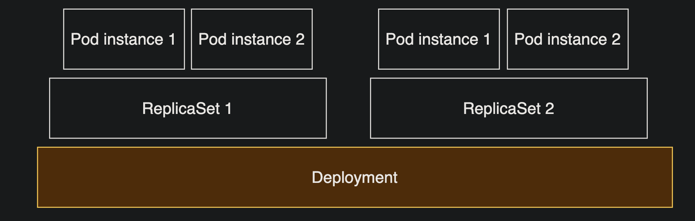

How to scale a deployment?

- `kubectl scale deployment <deployment-name> --replicas=3` - scale a deployment to 3 replicas

How to set a deployment's image? (Rolling update) - zero downtime deployment (blue/green deployment) 

- `kubectl set image deployment <deployment-name> <container-name>=<image-name>` - set a deployment's image

How to get a deployment's history?

- `kubectl rollout history deployment <deployment-name>` - get a deployment's history

How to rollback a deployment?

- `kubectl rollout undo deployment <deployment-name>` - rollback a deployment

#### Kubernetes Services

- A Service in Kubernetes is an abstraction which defines a logical set of Pods and a policy by which to access them
- Services enable a loose coupling between dependent Pods
- A Service can be configured to route traffic to a set of Pods
- A Service can be configured to proxy traffic to a set of Pods
- A Service can be configured to proxy traffic to a single Pod
- A Service can be configured to expose multiple identical Pods as a single virtual IP address
- A Service can be configured to expose a set of Pods as a virtual IP address that is not managed by Kubernetes
- A Service can be configured to expose a set of Pods as a DNS name that is not managed by Kubernetes
- A Service can be configured to expose a set of Pods as a DNS name that is managed by Kubernetes
- A Service can be configured to expose a set of Pods as a set of DNS records that are managed by Kubernetes
- A Service can be configured to expose a set of Pods as a set of DNS records that are managed by Kubernetes and are resolvable from outside the cluster
- A Service can be configured to expose a set of Pods as a set of DNS records that are managed by Kubernetes and are resolvable from outside the cluster and are load balanced
- A Service can be configured to expose a set of Pods as a set of DNS records that are managed by Kubernetes and are resolvable from outside the cluster and are load balanced and are sticky (session-affinity)
- A Service can be configured to expose a set of Pods as a set of DNS records that are managed by Kubernetes and are resolvable from outside the cluster and are load balanced and are sticky (session-affinity) and are load balanced across multiple ports
- A Service can be configured to expose a set of Pods as a set of DNS records that are managed by Kubernetes and are resolvable from outside the cluster and are load balanced and are sticky (session-affinity) and are load balanced across multiple ports and are load balanced across multiple protocols
- A Service can be configured to expose a set of Pods as a set of DNS records that are managed by Kubernetes and are resolvable from outside the cluster and are load balanced and are sticky (session-affinity) and are load balanced across multiple ports and are load balanced across multiple protocols and are load balanced across multiple ports and protocols

#### Kubernetes Responsibilities

- Kubernetes is responsible for:
  - Scheduling
  - Scaling
  - Load balancing
  - Health checks
  - Rolling updates
  - Rollbacks
  - Service discovery
  - Secret and configuration management
  - Storage orchestration
  - Batch execution
  - Access control
  - Monitoring
  - Logging
  - Self-healing
  - Auto-scaling
  - Multi-tenancy
  - Multi-cloud support

### Example kubectl commands

- `kubectl create deployment hello-world --image=gcr.io/google-samples/hello-app:1.0` - create a deployment
- `kubectl get deployments` - list all deployments
- `kubectl expose deployment hello-world --type=LoadBalancer --port=8080` - expose a deployment
- `kubectl scale deployment hello-world --replicas=3` - scale a deployment
- `kubectl delete pod hello-world-xxxxx` - delete a pod
- `kubectl autoscale deployment hello-world --min=3 --max=10 --cpu-percent=80` - autoscale a deployment

#### Edit deployment.extensions/hello-world
- `kubectl edit deployment.extensions/hello-world`

#### Check events

- `kubectl get events`
- `kubectl get events --sort-by=.metadata.creationTimestamp` - sort events by creation timestamp

#### Check pods

- `kubectl get pods`

#### Check replicasets

- `kubectl get replicasets`

#### Check deployments

- `kubectl get deployments`

#### Check services

- `kubectl get services`

Example file contents:
```
apiVersion: extensions/v1beta1
kind: Deployment
metadata:
  creationTimestamp: "2020-10-03T20:47:39Z"
  generation: 1
  labels:
    app: hello-world
  name: hello-world
  namespace: default
  resourceVersion: "1000"
  selfLink: /apis/extensions/v1beta1/namespaces/default/deployments/hello-world
  uid: 3b5b5b5b-5b5b-5b5b-5b5b-5b5b5b5b5b5b
spec:
  progressDeadlineSeconds: 600
  replicas: 3
  revisionHistoryLimit: 10
  selector:
    matchLabels:
      app: hello-world
  strategy:
    rollingUpdate:
      maxSurge: 25%
      maxUnavailable: 25%
    type: RollingUpdate
  template:
    metadata:
      creationTimestamp: null
      labels:
        app: hello-world
    spec:
      containers:
      - image: gcr.io/google-samples/hello-app:1.0
        imagePullPolicy: Always
        name: hello-world
        ports:
        - containerPort: 8080
          protocol: TCP
        resources: {}
        terminationMessagePath: /dev/termination-log
        terminationMessagePolicy: File
      dnsPolicy: ClusterFirst
      restartPolicy: Always
      schedulerName: default-scheduler
      securityContext: {}
      terminationGracePeriodSeconds: 30

```

### Cloud Orchestration Options
- AWS
  - Elastic Container Service (ECS)
  - Elastic Kubernetes Service (EKS)
  - Fargate
- Azure
  - Azure Kubernetes Service (AKS)
  - Azure Container Instances (ACI)
- Google Cloud
  - Google Kubernetes Engine (GKE) 
  - Google Cloud Run

#### Google Cloud Engine (GKE)

- https://cloud.google.com/kubernetes-engine/docs/quickstart

Install Google Cloud SDK 

- https://cloud.google.com/sdk/docs/install

### Quickstart with K8s/Docker/Maven

1. Create Maven project images (`/kubernetes/`)
   - `mvn clean package`
   - Run docker daemon
   - `mvn spring-boot:build-image -DskipTests`
2. Add to docker registry
    - `docker push seanmayerz/smr-currency-exchange-service-kubernetes:0.0.1-SNAPSHOT`
    - `docker push seanmayerz/smrk8-currency-conversion-service:0.0.11-SNAPSHOT`
    - Check docker registry https://hub.docker.com/u/seanmayerz
3. Create Kubernetes cluster in GKE
- Login to https://cloud.google.com/ (using free trial credits)
- Create new project
- Enable Kubernetes Engine API
- Create cluster
      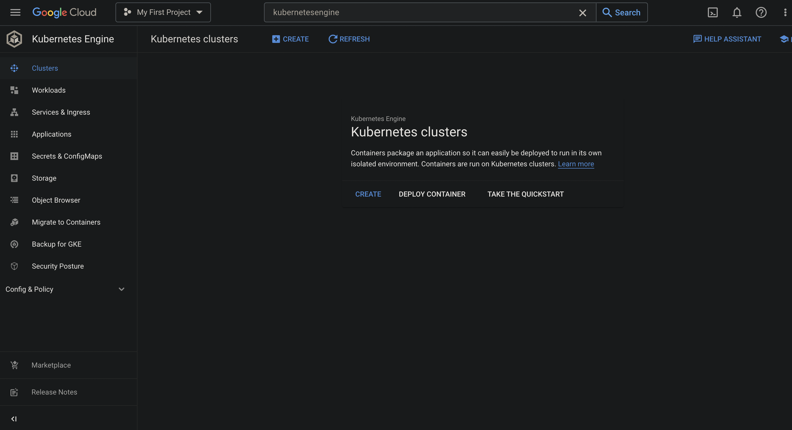

4. Deploy microservice to Kubernetes
  - `kubectl version`
  - `kubectl create deployment currency-exchange-service --image=seanmayerz/smr-currency-exchange-service-kubernetes:0.0.1-SNAPSHOT`
  - `kubectl expose deployment currency-exchange-service --type=LoadBalancer --port=8000`
  - `kubectl get svc` or `kubectl get services`
  - `kubectl get pods`
  - `kubectl get rs` or `kubectl get replicasets`
  - `kubectl get all`
  

## Issues
### Running multiple springboot microservice projects in VSCode (Without Docker)
- This is a known issue https://github.com/microsoft/vscode-java-debug/issues/606, https://github.com/eclipse/eclipse.jdt.ls/issues/1137, which caused the new package not recognized during building workspace. It's expected to be fixed in vscode-java Middle October release.

Current workaround is reload VS Code window, or F1 ->Clean the java language server workspace.

Reference: https://stackoverflow.com/questions/57857855/could-not-find-or-load-main-class-vs-code