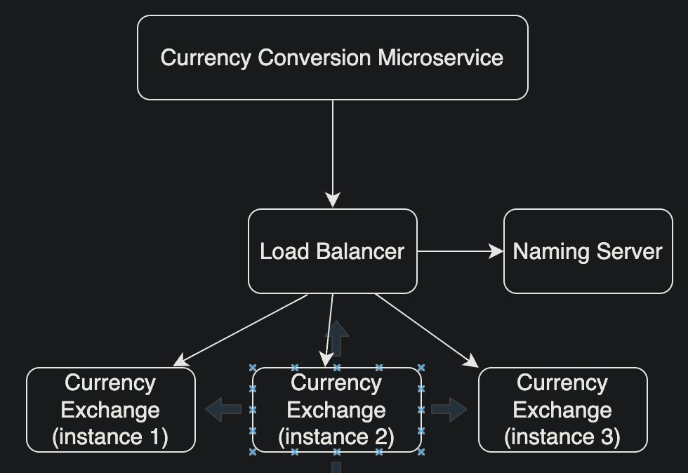

# Spring Microservices Refresher

## Introduction
- Spring boot
- Spring Cloud
- Spring Cloud Gateway
- Resilience4j
- Docker
- Kubernetes

## Load Balancing

## Issues
### Running multiple springboot microservice projects in VSCode
- This is a known issue https://github.com/microsoft/vscode-java-debug/issues/606, https://github.com/eclipse/eclipse.jdt.ls/issues/1137, which caused the new package not recognized during building workspace. It's expected to be fixed in vscode-java Middle October release.

Current workaround is reload VS Code window, or F1 ->Clean the java language server workspace.

Reference: https://stackoverflow.com/questions/57857855/could-not-find-or-load-main-class-vs-code