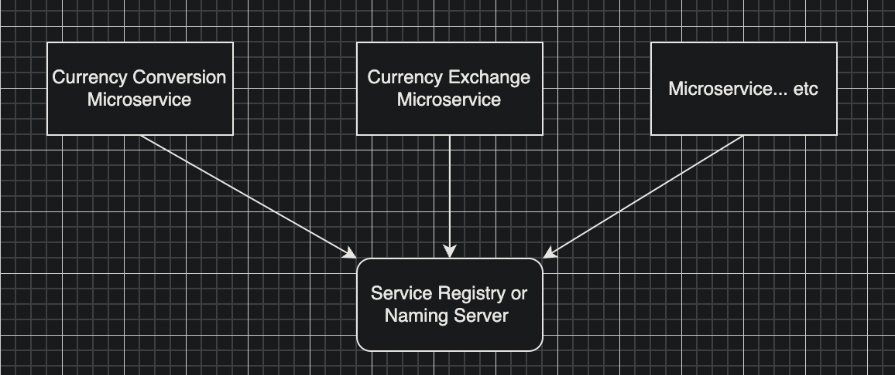

# Spring Microservices Refresher

- Naming server - http://localhost:8761/
- Microservice 1 - http://localhost:8000/
- Microservice 2 - http://localhost:8001/
- H2 Database - http://localhost:8080/h2-console
- Gateway - http://localhost:8765
  - http://localhost:8765/currency-exchange/from/USD/to/INR
  - http://localhost:8765/currency-conversion/from/USD/to/INR/quantity/10
  - http://localhost:8765/currency-conversion-feign/from/USD/to/INR/quantity/10
  - http://localhost:8765/currency-conversion-new/from/USD/to/INR/quantity/10

## Introduction
- Spring boot
- Spring Cloud
- Spring Cloud Gateway
- Resilience4j
- Docker
- Kubernetes

## Microservices Overview

## Naming Server

In a microservice architecture, a naming server serves as a registry for service discovery. Each microservice in the system has a unique name and runs on its own address, and the naming server maintains a mapping between the service names and their addresses. When a client wants to access a certain microservice, it can query the naming server to find the address of the service it needs. This eliminates the need for hard-coded addresses and allows for dynamic reconfiguration of the system as services come and go. The naming server plays a crucial role in the seamless functioning of a microservice-based system.

In this example we use Eureka naming server.

## Load Balancing

In a microservice architecture, a load balancer is an important component that sits between the client and the microservices. Its primary function is to distribute incoming requests to multiple instances of a microservice, improving system reliability and scalability.

When a client makes a request, the load balancer routes it to one of the available instances of the target microservice. This helps to evenly distribute the incoming request load, avoid overloading any single instance, and prevent a single point of failure. In case an instance of the microservice fails, the load balancer can detect this and redirect requests to other healthy instances.

By using a load balancer, microservice-based systems can dynamically scale up or down the number of instances of a service based on the incoming request volume, ensuring that the system remains responsive and resilient even under high load.

## Issues
### Running multiple springboot microservice projects in VSCode
- This is a known issue https://github.com/microsoft/vscode-java-debug/issues/606, https://github.com/eclipse/eclipse.jdt.ls/issues/1137, which caused the new package not recognized during building workspace. It's expected to be fixed in vscode-java Middle October release.

Current workaround is reload VS Code window, or F1 ->Clean the java language server workspace.

Reference: https://stackoverflow.com/questions/57857855/could-not-find-or-load-main-class-vs-code